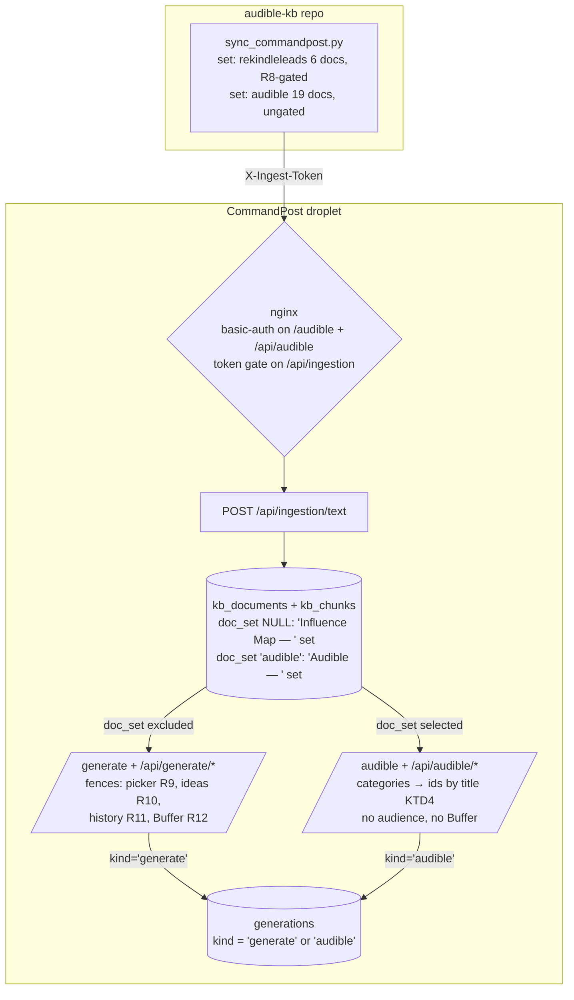

# Phil's Audible AI Page - Plan

**Target repos:** `commandpost` (primary — all paths below are relative to it unless a unit says otherwise) and `audible-kb` (sync expansion, U5).

---

## Goal Capsule

- **Objective:** Ship a new CommandPost dashboard page, "Phil's Audible AI" (`/audible`), that generates the same seven content types as `/generate` but grounded in one or more Audible Influence Map categories, saves every generation, and keeps the full Audible doc set (including personal-register material) fenced off from all ReKindleLeads-facing surfaces and behind an nginx auth gate.
- **Authority:** This plan > repo conventions > implementer preference. Product decisions (full 18-theme set, nginx gating, no Buffer/avatar) were confirmed by Phil and are not re-litigable during implementation.
- **Stop conditions:** Stop and surface to Phil if (a) the nginx gate cannot be applied on the droplet — do **not** sync personal docs to production without it (R13); (b) fencing proves impossible without restructuring `kb_documents` (contradicts KTD1/KTD2); (c) any change would alter the existing `/generate` UX beyond removing Audible docs from its sources.
- **Execution profile:** Code, two repos. CommandPost units are test-covered TypeScript (vitest); the audible-kb unit is a Python script change verified by its own `--check` mode. Production rollout order matters: gate before sync (see Operational Notes).
- **Tail ownership:** Implementer commits and pushes; deploy is `scripts/deploy.sh` (ships from `origin/main`). The droplet nginx change and the first production sync are Phil-executed ops steps documented in U6.

---

## Product Contract

### Summary

Add an `/audible` page that mirrors the Generate studio's create-and-save flow but swaps the KB source picker for Audible category selection, drops the ReKindleLeads audience and Buffer integrations, and writes to a segregated history. A second synced doc set delivers all 18 Audible theme syntheses plus the worldview profile to the server, while four fences keep that material out of every ReKindleLeads-facing surface.

### Problem Frame

Phil's Audible knowledge base (`~/audible-kb`) distills 793 listens into 18 theme syntheses and a worldview profile, but only a 6-doc business-voice subset is synced into CommandPost, and the only generation surface (`/generate`) is wired for ReKindleLeads marketing: master-profile audience always applied, social output auto-drafted to Buffer. There is no way to generate content grounded in the full Influence Map. Putting the full set on the server crosses a deliberate privacy line (the sync's R8 gate exists to keep faith/NDE register off CommandPost), so the feature needs explicit fencing and access gating, not just a new page.

### Requirements

**Page and generation**

- R1. A new dashboard page "Phil's Audible AI" at `/audible`, reachable from the sidebar, mobile nav, and command palette.
- R2. The user selects one or more Audible categories (the 18 themes plus the worldview profile as a selectable option) to ground generation.
- R3. Generation offers the same seven content types, topic, and length controls as `/generate`, rendering the result with copy-to-clipboard.
- R4. Generation applies no ReKindleLeads audience (no master profile, no avatar) and never drafts to Buffer.
- R5. A generation request with zero categories selected is rejected with a 400 — this page never produces ungrounded output.
- R6. Every generation is saved and browsable in the page's own history with load-back and delete, fully separate from Generate's history.

**Audible doc set (audible-kb sync)**

- R7. A second synced doc set delivers the 18 theme syntheses plus `kb/profile.md` with a distinct `Audible — ` title prefix, `source_type: system`, its own manifest, and no R8 register gate.
- R8. The existing 6-doc `Influence Map — ` business subset is unchanged and continues to serve `/generate`.

**Fencing (ReKindleLeads surfaces)**

- R9. The `/generate` source picker never lists Audible-set docs, and `POST /api/generate` rejects (400) any request whose `sourceIds` include an Audible-set doc — the fence is server-side, not just UI.
- R10. The ideas generator never samples Audible-set chunks.
- R11. Generate's history list, load-back, and detail endpoints never return Audible generations; the Audible page's history shows only its own.
- R12. Neither Buffer path (per-generation auto-draft, history-wide backfill) can ever push an Audible generation.

**Access control**

- R13. `/audible`, its API routes, **and the existing `/api/backup` route** (which serves the raw SQLite DB file and would otherwise bypass every fence) are gated by nginx basic-auth on the droplet (same pattern as `/ingestion`), applied **before** the first production sync of personal docs.

### Acceptance Examples

- AE1. **Given** a fresh re-sync replaced all Audible doc ids, **when** a user who loaded the page before the sync generates, **then** the server resolves categories to current doc ids by title and the generation is grounded (`sources_used > 0`).
- AE2. **Given** Audible generations with social content types exist, **when** "Send social to Buffer" backfill runs from `/generate`, **then** zero Audible rows are pushed.
- AE3. **Given** no Audible docs are synced yet, **when** the page loads, **then** it shows an empty state naming the sync as the fix instead of an empty category list.

### Scope Boundaries

**Deferred to Follow-Up Work**

- Ideas panel for `/audible` (Generate's ideas endpoint stays ReKindleLeads-only for now).
- Persona/voice override for `generateContent` — v1 keeps the existing "marketing content writer" system prompt, so output stays CTA-shaped even without an audience; a small persona seam is the follow-up if the voice grates.
- Vector retrieval — Audible retrieval runs keyword-mode until `VOYAGE_API_KEY` lands; the existing `/api/generate/embed-backfill` already covers Audible chunks when it does.
- History pagination (inherits the existing LIMIT 100).
- Book-level deep notes / shortlist docs as categories (themes + profile only in v1).

**Outside this product's identity**

- No Buffer or any social publishing from the Audible page.
- No avatar/audience layer on the Audible page.
- No sync automation — the Audible sync is run manually like the existing subset.

---

## Planning Contract

### Key Technical Decisions

- **KTD1. Two independent doc sets.** The new Audible set (19 docs, ungated register) coexists with the existing `Influence Map — ` subset (6 docs, R8-gated, business voice). Five theme files exist in both sets (~40KB duplication) — accepted, because it keeps the ReKindleLeads grounding untouched (R8). The sets are distinguished by the `doc_set` column (KTD2).
- **KTD2. The fence keys on a `kb_documents.doc_set` column, not title strings.** `kb_documents` gains a nullable `doc_set TEXT` column (same additive-ALTER pattern as KTD3); `/api/ingestion/text` accepts an optional `doc_set` field restricted to `'audible'`; the sync sends it; existing docs stay NULL (ReKindleLeads-visible). Every fence — picker exclusion, ideas exclusion, sourceIds rejection, category listing — is a column equality. A title-prefix fence was considered and rejected: it makes an em-dash byte match load-bearing across Python and TS with no shared code, and any hand-pasted doc titled `Audible — …` would silently cross the fence. The `Audible — ` title prefix remains purely a display/naming convention (category labels strip it; the /ingestion list stays readable), carried by a small exported constant in `src/lib/audible.ts`.
- **KTD3. `generations.kind` discriminator, `TEXT NOT NULL DEFAULT 'generate'`.** Added via the established pragma-guarded additive-ALTER pattern in `src/lib/db.ts`. `NOT NULL DEFAULT` makes every fence a clean equality (`kind = 'audible'` / `kind = 'generate'`) — no NULL-branch logic that could silently reopen the Buffer leak on legacy rows.
- **KTD4. Categories resolve to doc ids server-side at generation time.** The client sends category names; the API resolves them to current `kb_documents` ids by title match within `doc_set = 'audible'`. Re-syncs delete-and-recreate docs (id churn), so ids baked into an open page would silently produce ungrounded output — name-based resolution at request time makes AE1 hold.
- **KTD9. Per-category retrieval, merged at the route.** `retrieveContext` returns k=8 chunks total across all passed docs, and its no-match fallback takes the first chunks by doc id — so a single call over a multi-category selection can ground almost entirely in one category. The Audible route loops: one `retrieveContext` call per selected category with `k = max(3, ceil(12 / categoryCount))`, results concatenated. `retrieveContext` itself stays unchanged (KTD5 holds — k is already an option; the loop is route-level), and every selected category is guaranteed to contribute chunks.
- **KTD5. Reuse `retrieveContext` and `generateContent` unchanged.** `generateContent` already takes optional `audience` — pass `undefined` and the avatar layer is fully absent. No changes to `src/lib/rag/retrieve.ts`, `src/lib/generation/generate.ts`, or `src/lib/generation/content-types.ts`.
- **KTD6. Dedicated `/api/audible/*` route namespace.** New POST generate, history, and `[id]` GET/DELETE routes, all `kind='audible'`-scoped. This gives nginx a clean prefix to gate and lets the shared `/api/generate/*` routes refuse Audible rows outright (R11) — reusing Generate's routes would leak gated content through ungated paths.
- **KTD7. The nginx gate is droplet-side ops, not repo config.** The live nginx config on the droplet is authoritative (`deploy/nginx.conf` in-repo is a stale placeholder); U6 documents the location blocks and the rollout order rather than pretending the repo controls it.
- **KTD8. New client component, forked from `generate-studio`.** `generate-studio.tsx` bakes in the avatar manager, ideas panel, and two Buffer touchpoints; forking and deleting those is cleaner than parameterizing a 365-line component. Load-back intentionally mirrors generate-studio: it restores content type, topic, and result — not category selection or length.

### High-Level Technical Design

The prose requirements are authoritative; the diagram shows where the two doc sets diverge and which surfaces the four fences protect.

---

## Implementation Units

### U1. Data layer: `kind` and `doc_set` discriminators, Audible-aware queries

- **Goal:** Segregate generations by origin and Audible docs by set membership, in one place each.
- **Requirements:** R6, R9, R11, R12 (foundations); KTD2, KTD3.
- **Dependencies:** none.
- **Files:** `src/lib/db.ts`, `src/lib/audible.ts` (new — display-prefix constant), `src/lib/queries/generation-queries.ts`, `src/lib/queries/kb-queries.ts`, `src/app/api/ingestion/text/route.ts`, `src/lib/types.ts`, `tests/queries/generation-queries.test.ts`, `tests/queries/kb-queries.test.ts` (new if absent), `tests/api/` ingestion test (extend nearest existing).
- **Approach:** Add `generations.kind TEXT NOT NULL DEFAULT 'generate'` and `kb_documents.doc_set TEXT` (nullable) using the pragma-guarded ALTER pattern (mirror the `avatar_id` migration in `src/lib/db.ts`). `createGeneration` accepts `kind` (default `'generate'`); `listGenerations` and the get-by-id query take a kind filter; `listUnpushedSocialGenerations` hard-filters `kind = 'generate'`. `createKbDocument` accepts `doc_set`; `/api/ingestion/text` accepts an optional `doc_set` field restricted to `'audible'` (reject other values, default NULL). In kb-queries, add doc_set-aware variants: list only Audible docs (for the page), exclude Audible docs (for Generate's picker), and a chunk query excluding Audible docs (for ideas).
- **Patterns to follow:** `src/lib/db.ts` `avatar_id` migration; `tests/queries/generation-queries.test.ts` (`initDb(':memory:')` per test, which doubles as migration coverage).
- **Test scenarios:**
  - Migration: after `initDb`, `generations.kind` and `kb_documents.doc_set` exist; a row inserted without `kind` stores `'generate'`; a kb doc inserted without `doc_set` stores NULL.
  - `createGeneration` with `kind: 'audible'` round-trips.
  - `listGenerations` filtered by kind returns only matching rows; unfiltered callers updated so no call site sees mixed kinds.
  - `listUnpushedSocialGenerations` never returns an `'audible'` row even when it is a social content type with `buffer_post_id IS NULL` (covers AE2 at query level).
  - Audible kb-doc list returns only `doc_set='audible'` docs; exclusion query returns everything else including the six `Influence Map — ` docs and a doc hand-titled `Audible — impostor` with NULL doc_set (locks the fence to the column, not the title).
  - Ingestion route: `doc_set: 'audible'` persists; `doc_set: 'anything-else'` → 400; omitted → NULL.
- **Verification:** `npm test` green; new tests fail before the query changes, pass after.

### U2. Fence the ReKindleLeads surfaces

- **Goal:** `/generate` and its endpoints behave exactly as today but can no longer see Audible docs or Audible generations.
- **Requirements:** R9, R10, R11, R12.
- **Dependencies:** U1.
- **Files:** `src/app/(dashboard)/generate/page.tsx`, `src/lib/generation/ideas.ts`, `src/app/api/generate/history/route.ts`, `src/app/api/generate/[id]/route.ts`, `src/app/api/generate/route.ts` (createGeneration call site untouched semantically — verify it lands `kind='generate'`), `tests/generation/ideas.test.ts` (or nearest existing ideas test), `tests/api/generate-backfill.test.ts`.
- **Approach:** Generate's page composes its source list from the exclusion query (U1). `sampleKbContext` in `ideas.ts` swaps its unfiltered `chunksForDocuments(db)` for U1's Audible-excluding chunk variant (join filter on `doc_set`). In `POST /api/generate`, validate incoming `sourceIds` server-side against U1's Audible-exclusion helper and return 400 if any id belongs to a `doc_set='audible'` doc — kb ids are guessable sequential integers, so without this check a caller (or stale client) could ground ReKindleLeads output in personal-register content through the ungated route and even auto-draft it to Buffer as `kind='generate'`. History route and `[id]` GET/DELETE scope to `kind = 'generate'` — an Audible id through the shared route returns 404. Backfill is already fenced by U1's query change; keep its test asserting that.
- **Patterns to follow:** existing query parameterization in `src/lib/queries/kb-queries.ts` (`chunksForDocuments`); route tests via `vi.mock` per `tests/api/generate-autodraft.test.ts`.
- **Test scenarios:**
  - Ideas sampling with Audible + non-Audible docs present returns zero Audible chunks.
  - `POST /api/generate` with an Audible doc id in `sourceIds` → 400; nothing is retrieved, persisted, or drafted to Buffer.
  - `GET /api/generate/history` returns only `kind='generate'` rows.
  - `GET /api/generate/[id]` and `DELETE` on an Audible row → 404, on a generate row → 200.
  - Generate POST still stores `kind='generate'` and still auto-drafts social to Buffer (regression guard: fence must not break existing behavior).
- **Verification:** `npm test` green; manually load `/generate` in dev — source picker shows the six Influence Map docs but no `Audible — ` docs; ideas panel still works.

### U3. Audible API routes

- **Goal:** Grounded generation and history CRUD for the new page, with no audience and no Buffer.
- **Requirements:** R2-R6; KTD4, KTD5, KTD6.
- **Dependencies:** U1.
- **Files:** `src/app/api/audible/generate/route.ts` (new), `src/app/api/audible/history/route.ts` (new), `src/app/api/audible/[id]/route.ts` (new), `tests/api/audible-generate.test.ts` (new), `tests/api/audible-history.test.ts` (new).
- **Approach:** POST accepts `{contentType, topic, length, categories: string[]}`. Validate content type via `isContentType`, topic non-empty, and `categories.length >= 1` (else 400, R5). Resolve categories → doc ids server-side by title within `doc_set='audible'` (KTD4); unknown category names → 400 naming them. Retrieve per category and merge (KTD9): one `retrieveContext` call per category with `k = max(3, ceil(12 / categoryCount))`, concatenated. Then `generateContent` with `audience: undefined` → `createGeneration` with `kind: 'audible'`. No Buffer import anywhere in the route. History and `[id]` routes mirror Generate's but scoped `kind = 'audible'`. `maxDuration = 120` like the Generate route. Heed the repo's Next.js 16 warning: route `params` are Promises (see `src/app/api/generate/[id]/route.ts`).
- **Patterns to follow:** `src/app/api/generate/route.ts` (minus audience/Buffer blocks), `src/app/api/generate/history/route.ts`, `src/app/api/generate/[id]/route.ts`; test mocking per `tests/api/generate-autodraft.test.ts`.
- **Test scenarios:**
  - Happy path: valid request with two categories → 200, result text, generation persisted with `kind='audible'`, correct `source_ids`.
  - Empty `categories` → 400; unknown category name → 400; invalid content type → 400; empty topic → 400.
  - Stale-selection grounding (AE1): categories resolve by name even when doc ids differ from an earlier listing.
  - Multi-category grounding (KTD9): with two categories selected, retrieval returns chunks from both docs, even when one category has no keyword overlap with the topic.
  - Buffer isolation: `draftGenerationToBuffer` is never called (assert the mock).
  - Generation failure (`generateContent` not ok) → 502, nothing persisted.
  - History returns only Audible rows; `[id]` GET/DELETE on a generate-kind row → 404.
- **Verification:** `npm test` green; `curl` the route in dev with a synced doc and confirm `sources_used > 0`.

### U4. Page and studio component

- **Goal:** The user-facing `/audible` experience.
- **Requirements:** R1, R2, R3, R6; AE3; KTD8.
- **Dependencies:** U3.
- **Files:** `src/app/(dashboard)/audible/page.tsx` (new), `src/components/audible-studio.tsx` (new), `src/components/sidebar.tsx`, `src/components/mobile-nav.tsx`, `src/components/command-palette.tsx`, `tests/api/` untouched. Nav note: only `sidebar.tsx` has a `/generate` entry to mirror — mobile-nav and command-palette have no `/generate` precedent; add fresh `/audible` entries following mobile-nav's `moreItems` shape and the palette's `commands` array shape, with `prefetch={false}` on links to the gated route so ungated pages don't fire 401 prefetches.
- **Approach:** Server page: `force-dynamic`, list Audible docs (U1 query), derive category labels by stripping the prefix, load initial `kind='audible'` history, render the standard dashboard header (icon square + title + subtitle) and the client component. Client: fork `generate-studio.tsx`; replace the source picker with category pills (multi-select) carrying the source picker's existing conveniences — All/None quick-select buttons and a live "{n} categories selected" count — and a client-side guard that blocks Generate with an inline error when zero categories are selected (mirroring the existing topic guard, so R5's 400 is a backstop rather than the first feedback the user sees); keep content-type groups, topic, length, generate button, result pane with copy; history panel with load-back and delete against `/api/audible/*`; delete the avatar manager, ideas panel, Buffer backfill button, and "In Buffer" badge entirely. Empty state when no Audible docs exist names the sync (AE3). Load-back restores content type, topic, result only (KTD8). Nav: add `/audible` entries (label "Phil's Audible AI", route is prefix-safe).
- **Patterns to follow:** `src/app/(dashboard)/generate/page.tsx` composition; `generate-studio.tsx` styling vocabulary (gray-900 cards, indigo primary, pill selection states); sidebar `navItems` shape.
- **Test scenarios:** Test expectation: none — pure UI composition over U3's tested routes; the repo has no component-test infrastructure (vitest is node-env only), matching existing pages.
- **Verification:** `npm run build` clean; in dev with synced docs: categories render, multi-select works, a generation appears in history, load-back and delete work, no Buffer/avatar UI anywhere; with an empty DB the AE3 empty state shows.

### U5. Audible doc-set sync (audible-kb repo)

- **Goal:** Deliver the 19-doc Audible set to CommandPost, repeatably, without touching the ReKindleLeads subset.
- **Requirements:** R7, R8; KTD1, KTD2.
- **Dependencies:** none code-wise; production run gated by U6 ordering.
- **Files (repo-relative to audible-kb):** `scripts/sync_commandpost.py`, `kb/commandpost-audible-manifest.md` (new, script-generated), `CLAUDE.md` (privacy-policy note), `kb/commandpost-manifest.md` untouched.
- **Approach:** Restructure the script around named doc sets: the existing `SUBSET` becomes the `rekindleleads` set (prefix `Influence Map — `, R8 gate ON, existing manifest); a new `audible` set lists all 18 theme files plus `kb/profile.md` with hand-curated display titles (mirroring the `SUBSET` pattern), display prefix `Audible — `, `doc_set: 'audible'` on every POST (KTD2 — the column is the fence; the prefix is cosmetic), its own manifest, R8 gate OFF. CLI selects the set (e.g. `load audible`, `update audible`; `--check` covers both). The R8 gate moves from the shared doc loader to per-set configuration. Update `CLAUDE.md`'s privacy rule to record the full sanctioned data path, not just the sync: Audible-set content (profile included) lives in CommandPost behind the nginx gate, transits the Anthropic API during every `/audible` generation, and will transit the Voyage API for embeddings once that key lands — this sentence amends Phil's standing "never into external services" rule, so surface it to him verbatim at rollout sign-off.
- **Execution note:** The script is deliberately stdlib-only and deterministic — keep it that way; prove behavior with a `--check` run and a dry-run against a local dev server rather than adding a test framework.
- **Test scenarios:** Test expectation: none (no test infra in audible-kb) — verification below stands in.
- **Verification:** `python3 scripts/sync_commandpost.py --check` passes for both sets against a dev CommandPost; `load audible` against dev creates 19 docs with exact `Audible — ` titles and leaves the 6 `Influence Map — ` docs untouched; re-running `update audible` after editing one theme replaces only that doc; running the `rekindleleads` set still R8-aborts on a register word.

### U6. Access gate and rollout runbook

- **Goal:** Personal-register content is never reachable ungated in production, and the rollout order is written down.
- **Requirements:** R13; KTD7.
- **Dependencies:** U1-U5 complete for the full rollout; the nginx step itself is independent.
- **Files:** `deploy/nginx.conf` (reference location blocks), `docs/runbooks/audible-rollout.md` (new).
- **Approach:** Add reference nginx `location` blocks for `/audible`, `/api/audible/`, and `/api/backup` using the same basic-auth pattern the droplet already applies to `/ingestion` (repo file is a reference; the droplet config is authoritative — the runbook says to apply it there). `/api/backup` streams the raw `data/commandpost.db` file, so leaving it ungated would hand out every Audible doc and generation in one GET. Runbook sequence: (1) merge + push + `scripts/deploy.sh` (app now live with fences but zero Audible docs — page shows AE3 empty state, harmless); (2) apply nginx gate on droplet, then verify with curl: `/audible` and `/api/audible/history` and `/api/backup` all return 401 without credentials, while `/generate` and `/api/generate/history` do not; (3) run `load audible` sync from the Mac; (4) verify in prod: categories render behind the gate, Generate picker/ideas/history show nothing Audible, a Buffer backfill run pushes nothing new.
- **Test scenarios:** Test expectation: none — config and runbook; the prod verification steps above are the proof.
- **Verification:** Runbook exists and matches reality after Phil executes it; step-2 check (gate before sync) is explicitly called out as the no-skip step.

---

## Verification Contract

| Gate | Command / check | Applies to |
|---|---|---|
| Unit + API tests | `npm test` (vitest) in commandpost | U1-U3 |
| Lint | `npm run lint` | U1-U4 |
| Build | `npm run build` | U1-U4 (Next 16 — consult `node_modules/next/dist/docs` for route/page APIs) |
| Sync integrity | `python3 scripts/sync_commandpost.py --check` (both sets) in audible-kb | U5 |
| Fence proof (dev) | With both doc sets in a dev DB: Generate picker, ideas sampling, Generate history, and Buffer backfill all Audible-free; `/audible` grounded generation with `sources_used > 0` | U2-U4 |
| Rollout proof (prod) | Runbook steps 2-4: auth prompt on `/audible` only, sync loads 19 docs, prod fence spot-checks | U6 |

---

## Definition of Done

- All six units implemented; `npm test`, `npm run lint`, `npm run build` green in commandpost.
- The four fences (R9-R12) each have a passing automated test, and AE1-AE3 hold.
- `/generate` behavior is unchanged except Audible docs are absent from its sources.
- audible-kb sync runs both sets correctly (`--check` clean) and the ReKindleLeads set still enforces R8.
- Work is committed and pushed; app deployed via `scripts/deploy.sh`; the nginx gate is documented and the runbook states gate-before-sync as mandatory.
- No dead code from the fork (unused avatar/ideas/Buffer remnants removed from `audible-studio.tsx`).

---

## Risks & Dependencies

- **Fence integrity.** The fence is the `doc_set` column (KTD2), so no cross-language string contract exists; the `Audible — ` prefix is display-only, and a dash typo costs a cosmetic label, not a fence hole. Residual risk: the sync must actually send `doc_set` on every audible-set POST — the U1 ingestion tests and U5 dev-run verification cover it.
- **Exposure window.** Audible generations contain personal-register text and live in the same SQLite DB; the app serves them only via gated `/api/audible/*` (shared routes 404 them), but the DB itself is downloadable via `/api/backup`, which is why R13 gates that route too. The remaining exposure risk is operational — syncing before gating, or a future droplet config edit silently dropping a gate — which the runbook ordering and curl verification (U6) exist to prevent.
- **Keyword-only retrieval quality.** Until Voyage embeddings exist, retrieval is keyword scoring; `retrieveContext`'s no-match fallback returns the first chunks by doc id, which in a single call over multiple docs would concentrate grounding in one category — KTD9's per-category loop exists precisely to prevent that. Output quality still depends on topic-term overlap, and the `retrieval_mode` badge will read "keyword".
- **Deploy ships `origin/main`.** `scripts/deploy.sh` does `git reset --hard origin/main` on the droplet — nothing is live until committed and pushed; partial local work never half-deploys.
- **Next.js 16 drift.** Repo instruction: this Next version post-dates training data; route handlers and pages must be written against `node_modules/next/dist/docs` (e.g., Promise-typed route params).

---

## Operational Notes

Rollout order is the one hard operational constraint: **deploy app → apply nginx gate → sync Audible set → verify fences** (U6 runbook). Deploying the app first is safe — the page renders an empty state until docs exist. The Voyage embed-backfill, if ever run after the key lands, will embed Audible chunks too; that is expected and requires no action.

---

## Post-Plan Addendum (2026-07-17, after U1-U6 shipped)

Scope grew beyond this plan in later commits on the same branch (`896819f..ae6acbb`), so two statements above no longer hold as written:

- **KTD5's "no changes" claim is stale.** `src/lib/rag/retrieve.ts` gained an optional `queryVectorCache` parameter (one query embedding per request), `src/lib/generation/generate.ts` gained the free-form `'prompt'` branch (assistant role framing instead of marketing writer), and `src/lib/generation/content-types.ts` gained `PROMPT_TYPE`, `ALL_CONTENT_TYPES`, and shared UI constants (`LENGTHS`, `LENGTH_OPTIONS`, `MODE_BADGE`, `contentTypeLabel`).
- **Shipped beyond the v1 scope boundaries:** book deep-note selection (Scope Boundaries deferred it), the Audible-only `'prompt'` content type (fenced off `/generate` server-side), and the personal-Stories subsystem — `scripts/ingest-audible-stories.ts`, the `kb_documents.theme` column, the Stories browse tab, `POST /api/audible/stories/pull`, and `GET /api/audible/story/[id]`.

These extensions carried their own reviews; this addendum records the drift so the plan is not read as a false invariant about which files are untouched or which capabilities are absent.
